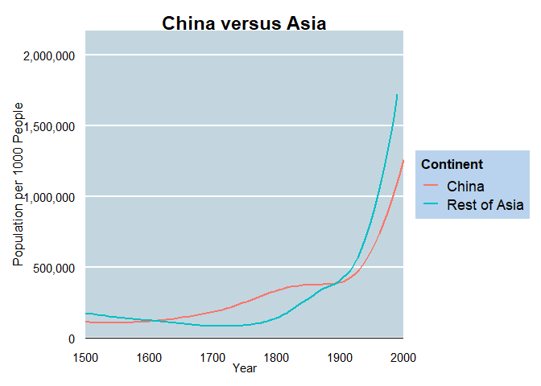

## 1) Data

I collected my data from an open source of world population data by country from the year 1500 to 2000. [Our World Data](https://ourworldindata.org/grapher/population-by-country) is the site that I download my data from. Some country codes were missing so I had to add them manually but this data didn't contain any missing values. 


  
## 2) Introduction

Here I am going to show how fast Asia and more specifically how fast China is growing in population. At this rate of growing Asia growing four times faster than Europe, Asia is definitely expected to feel drastic expansion in the next century. Did China's one child policy help with decreasing population growth? Hard to tell, but China would have had fewer children abandoned and even killed if it wasn’t for this policy. Through comparing China’s growth with other Asian countries and comparing Asia’s overall growth to other continents and interacting time with different continents we can find China’s and Asia’s rate of growth per year. 


## 3) Plots

### Population of Continents

Here we Asia start off significantly higher than every other continent in 1500 start with a slight decrease and then sky rockets around 1750. All other continents remain fairly consistent compared to each other. I wonder if this growth difference in Asia comes from all counties or a few specific ones. 

<!-- -->

### Asia versus the rest of the World

Further investigating population I compared Asia to the rest of the world. They completely dominate the rate of growth and looks like nothing is stopping it from slowing down. I wonder if China accounts for a large portion of this growth. They are the only country to have ever had a one child policy in their country which occurred from 1980-2015. 


<!-- -->

### China versus Asia

Is China the main factor for Asia's population? Here we see they were till 1900. Next I will show you what other countries could be contributing to this growth. 
<!-- -->
  
### Top Ten Most Populated Asian Countries

It appears that there aren't very many significant large growing countries in Asia besides India. Today India is very close to China's population with only about 20,000 less people. 
<!-- -->
  


## 4) Fixed Effect of One Child Policy in China


```r
data = data %>% mutate(one_child_policy = ifelse(1980 <= year & year <= 2015 & code == "CHN", 1, 0))
china_vs_asia = china_vs_asia %>% mutate(one_child_policy = ifelse(1980 <= year & year <= 2015 & Continent == "China", 1, 0))

reg_fe_china_vs_wd = felm(population~one_child_policy|year + country_name, data = data)
reg_fe_china_vs_asia = felm(population~one_child_policy|year + Continent, data = china_vs_asia)
```


<table style="text-align:center"><tr><td colspan="3" style="border-bottom: 1px solid black"></td></tr><tr><td style="text-align:left"></td><td colspan="2"><em>Dependent variable:</em></td></tr>
<tr><td></td><td colspan="2" style="border-bottom: 1px solid black"></td></tr>
<tr><td style="text-align:left"></td><td colspan="2">Population</td></tr>
<tr><td style="text-align:left"></td><td>China v. World</td><td>China v. Asia</td></tr>
<tr><td style="text-align:left"></td><td>(1)</td><td>(2)</td></tr>
<tr><td colspan="3" style="border-bottom: 1px solid black"></td></tr><tr><td style="text-align:left">One Child Policy</td><td>722,027.700<sup>***</sup></td><td>-698,237.100<sup>***</sup></td></tr>
<tr><td style="text-align:left"></td><td>(15,820.300)</td><td>(104,554.700)</td></tr>
<tr><td style="text-align:left"></td><td></td><td></td></tr>
<tr><td colspan="3" style="border-bottom: 1px solid black"></td></tr><tr><td style="text-align:left">Observations</td><td>3,221</td><td>52</td></tr>
<tr><td style="text-align:left">R<sup>2</sup></td><td>0.840</td><td>0.964</td></tr>
<tr><td colspan="3" style="border-bottom: 1px solid black"></td></tr><tr><td style="text-align:left"><em>Note:</em></td><td colspan="2" style="text-align:right"><sup>*</sup>p<0.1; <sup>**</sup>p<0.05; <sup>***</sup>p<0.01</td></tr>
</table>


**Running a fixed effect linear regression holding country and year constant comparing China's population in 1980, 1990 and 2000 to the rest of the world form 1500 to 2000 this shows us that China's one child policy had a positive effect on population from the years 1980 to 2000. China's impact of the one child policy increased their population by 722,027,747 people from 1980-2000. It is hard to safely evaluate China's population with just three data points with a fixed effect against the rest of the world from 1500 to 2000 so I also ran a fixed effect regression comparing China during the One Child Policy to the rest of Asia. Doing so I found that China's impact of the one child policy decreased their population by 698,237,052 people from 1980-2000. With these significant coefficients that are very different I think it is safe to assume that there is some heteroskedasticity present with some countries having relatively consistent populations and others not having as consistent populations. To continue to find the impact of China's one child policy on China's population I would look closer at the population of countries every year instead of every decade.**  


  
## 5) Rate of growth per Continent

**Here I ran four different linear regressions looking for the marginal increase of population per continent per year. My results were not very robust. When I combined every country into continents rather than having them separate with the `group_by()` and `summarize()` functions in `dplyr` I was able to confidently find that every year Europe gains about 10,604,000 and Asia gains about 40,472,342. Both of these coefficients were statistically significant with a p value of less than 0.05. Through interacting year with population and factoring continents I wasn't able to find anything robust enough of population growth. Here are the four linear regressions I ran below. **  

Interacting Year: $Population_{it} = \beta_0 + \beta_1Continent * Year_t + \epsilon_i + \epsilon_t$  
$Population_{i} = \beta_0 + \beta_1Continent+ \epsilon_i$  
This is the one where I grouped countries: $Population_{it} = \beta_0 + \beta_1Continent * Year_t + \epsilon_i + \epsilon_t$  
Factoring Continents: $Population_{it} = \beta_0 + (\beta_1Americas_i + \beta_2Asia_i + \beta_3Europe_i + \beta_4Oceania_i + \beta_5Africa_i) * Year_t + \epsilon_i + \epsilon_t$  


```r
linear.1 = reg_continent_fact = lm(data = data, population~(Continent) * year)
linear.2 = reg_continent_interact = lm(data = data, population~Continent)
linear.3 = reg_continent_interact_sig = lm(sum~Continent * year, data = df)
linear.4 = reg_continent_fact_asia = lm(population~(factor_continent)*year, data = asia_vs_rest)
```


% Table created by stargazer v.5.2.2 by Marek Hlavac, Harvard University. E-mail: hlavac at fas.harvard.edu
% Date and time: Tue, Jan 25, 2022 - 6:45:15 PM
\begin{table}[!htbp] \centering 
  \caption{} 
  \label{} 
\begin{tabular}{@{\extracolsep{5pt}}lccccccc} 
\\[-1.8ex]\hline 
\hline \\[-1.8ex] 
Statistic & \multicolumn{1}{c}{N} & \multicolumn{1}{c}{Mean} & \multicolumn{1}{c}{St. Dev.} & \multicolumn{1}{c}{Min} & \multicolumn{1}{c}{Pctl(25)} & \multicolumn{1}{c}{Pctl(75)} & \multicolumn{1}{c}{Max} \\ 
\hline \\[-1.8ex] 
rating & 30 & 64.633 & 12.173 & 40 & 58.8 & 71.8 & 85 \\ 
complaints & 30 & 66.600 & 13.315 & 37 & 58.5 & 77 & 90 \\ 
privileges & 30 & 53.133 & 12.235 & 30 & 45 & 62.5 & 83 \\ 
learning & 30 & 56.367 & 11.737 & 34 & 47 & 66.8 & 75 \\ 
raises & 30 & 64.633 & 10.397 & 43 & 58.2 & 71 & 88 \\ 
critical & 30 & 74.767 & 9.895 & 49 & 69.2 & 80 & 92 \\ 
advance & 30 & 42.933 & 10.289 & 25 & 35 & 47.8 & 72 \\ 
\hline \\[-1.8ex] 
\end{tabular} 
\end{table} 

% Table created by stargazer v.5.2.2 by Marek Hlavac, Harvard University. E-mail: hlavac at fas.harvard.edu
% Date and time: Tue, Jan 25, 2022 - 6:45:15 PM
\begin{table}[!htbp] \centering 
  \caption{} 
  \label{} 
\begin{tabular}{@{\extracolsep{5pt}} cccccccc} 
\\[-1.8ex]\hline 
\hline \\[-1.8ex] 
 & rating & complaints & privileges & learning & raises & critical & advance \\ 
\hline \\[-1.8ex] 
1 & $43$ & $51$ & $30$ & $39$ & $61$ & $92$ & $45$ \\ 
2 & $63$ & $64$ & $51$ & $54$ & $63$ & $73$ & $47$ \\ 
3 & $71$ & $70$ & $68$ & $69$ & $76$ & $86$ & $48$ \\ 
4 & $61$ & $63$ & $45$ & $47$ & $54$ & $84$ & $35$ \\ 
5 & $81$ & $78$ & $56$ & $66$ & $71$ & $83$ & $47$ \\ 
6 & $43$ & $55$ & $49$ & $44$ & $54$ & $49$ & $34$ \\ 
7 & $58$ & $67$ & $42$ & $56$ & $66$ & $68$ & $35$ \\ 
8 & $71$ & $75$ & $50$ & $55$ & $70$ & $66$ & $41$ \\ 
9 & $72$ & $82$ & $72$ & $67$ & $71$ & $83$ & $31$ \\ 
10 & $67$ & $61$ & $45$ & $47$ & $62$ & $80$ & $41$ \\ 
11 & $64$ & $53$ & $53$ & $58$ & $58$ & $67$ & $34$ \\ 
12 & $67$ & $60$ & $47$ & $39$ & $59$ & $74$ & $41$ \\ 
13 & $69$ & $62$ & $57$ & $42$ & $55$ & $63$ & $25$ \\ 
14 & $68$ & $83$ & $83$ & $45$ & $59$ & $77$ & $35$ \\ 
15 & $77$ & $77$ & $54$ & $72$ & $79$ & $77$ & $46$ \\ 
16 & $81$ & $90$ & $50$ & $72$ & $60$ & $54$ & $36$ \\ 
17 & $74$ & $85$ & $64$ & $69$ & $79$ & $79$ & $63$ \\ 
18 & $65$ & $60$ & $65$ & $75$ & $55$ & $80$ & $60$ \\ 
19 & $65$ & $70$ & $46$ & $57$ & $75$ & $85$ & $46$ \\ 
20 & $50$ & $58$ & $68$ & $54$ & $64$ & $78$ & $52$ \\ 
21 & $50$ & $40$ & $33$ & $34$ & $43$ & $64$ & $33$ \\ 
22 & $64$ & $61$ & $52$ & $62$ & $66$ & $80$ & $41$ \\ 
23 & $53$ & $66$ & $52$ & $50$ & $63$ & $80$ & $37$ \\ 
24 & $40$ & $37$ & $42$ & $58$ & $50$ & $57$ & $49$ \\ 
25 & $63$ & $54$ & $42$ & $48$ & $66$ & $75$ & $33$ \\ 
26 & $66$ & $77$ & $66$ & $63$ & $88$ & $76$ & $72$ \\ 
27 & $78$ & $75$ & $58$ & $74$ & $80$ & $78$ & $49$ \\ 
28 & $48$ & $57$ & $44$ & $45$ & $51$ & $83$ & $38$ \\ 
29 & $85$ & $85$ & $71$ & $71$ & $77$ & $74$ & $55$ \\ 
30 & $82$ & $82$ & $39$ & $59$ & $64$ & $78$ & $39$ \\ 
\hline \\[-1.8ex] 
\end{tabular} 
\end{table} 

<table style="text-align:center"><tr><td colspan="5" style="border-bottom: 1px solid black"></td></tr><tr><td style="text-align:left"></td><td colspan="4"><em>Dependent variable:</em></td></tr>
<tr><td></td><td colspan="4" style="border-bottom: 1px solid black"></td></tr>
<tr><td style="text-align:left"></td><td colspan="2">Countries Ungrouped</td><td>Countries Grouped</td><td>Asia vs the World</td></tr>
<tr><td style="text-align:left"></td><td>(1)</td><td>(2)</td><td>(3)</td><td>(4)</td></tr>
<tr><td colspan="5" style="border-bottom: 1px solid black"></td></tr><tr><td style="text-align:left">Americas</td><td>-23,934,552.000</td><td>2,645,284.000</td><td>-396,702,522.000</td><td></td></tr>
<tr><td style="text-align:left"></td><td>(59,298,139.000)</td><td>(3,004,295.000)</td><td>(1,151,794,442.000)</td><td></td></tr>
<tr><td style="text-align:left"></td><td></td><td></td><td></td><td></td></tr>
<tr><td style="text-align:left">Asia</td><td>-80,441,702.000</td><td>36,031,992.000<sup>***</sup></td><td>-6,190,322,475.000<sup>***</sup></td><td></td></tr>
<tr><td style="text-align:left"></td><td>(59,598,928.000)</td><td>(3,073,786.000)</td><td>(1,215,447,318.000)</td><td></td></tr>
<tr><td style="text-align:left"></td><td></td><td></td><td></td><td></td></tr>
<tr><td style="text-align:left">Europe</td><td>-1,449,105.000</td><td>6,163,653.000<sup>**</sup></td><td>-659,222,372.000</td><td></td></tr>
<tr><td style="text-align:left"></td><td>(58,141,031.000)</td><td>(2,977,375.000)</td><td>(1,215,447,318.000)</td><td></td></tr>
<tr><td style="text-align:left"></td><td></td><td></td><td></td><td></td></tr>
<tr><td style="text-align:left">Oceania</td><td>40,566,298.000</td><td>-3,443,381.000</td><td>1,528,449,922.000</td><td></td></tr>
<tr><td style="text-align:left"></td><td>(105,395,398.000)</td><td>(4,929,381.000)</td><td>(1,275,269,462.000)</td><td></td></tr>
<tr><td style="text-align:left"></td><td></td><td></td><td></td><td></td></tr>
<tr><td style="text-align:left">Year</td><td></td><td></td><td></td><td>1,996,478.000</td></tr>
<tr><td style="text-align:left"></td><td></td><td></td><td></td><td>(2,128,678.000)</td></tr>
<tr><td style="text-align:left"></td><td></td><td></td><td></td><td></td></tr>
<tr><td style="text-align:left">Americas:Year</td><td>28,669.120</td><td></td><td>959,523.900<sup>**</sup></td><td>4,769.687<sup>***</sup></td></tr>
<tr><td style="text-align:left"></td><td>(23,737.870)</td><td></td><td>(449,760.200)</td><td>(853.899)</td></tr>
<tr><td style="text-align:left"></td><td></td><td></td><td></td><td></td></tr>
<tr><td style="text-align:left">Asia:Year</td><td>14,560.550</td><td></td><td>233,687.900</td><td></td></tr>
<tr><td style="text-align:left"></td><td>(31,312.390)</td><td></td><td>(623,494.400)</td><td></td></tr>
<tr><td style="text-align:left"></td><td></td><td></td><td></td><td></td></tr>
<tr><td style="text-align:left">Europe:Year</td><td>61,808.630<sup>**</sup></td><td></td><td>3,810,163.000<sup>***</sup></td><td></td></tr>
<tr><td style="text-align:left"></td><td>(31,374.390)</td><td></td><td>(656,126.700)</td><td></td></tr>
<tr><td style="text-align:left"></td><td></td><td></td><td></td><td></td></tr>
<tr><td style="text-align:left">Oceania:Year</td><td>4,420.707</td><td></td><td>429,381.200</td><td></td></tr>
<tr><td style="text-align:left"></td><td>(30,678.840)</td><td></td><td>(656,126.700)</td><td></td></tr>
<tr><td style="text-align:left"></td><td></td><td></td><td></td><td></td></tr>
<tr><td style="text-align:left">ContinentOceania:year</td><td>-23,154.750</td><td></td><td>-911,152.600</td><td></td></tr>
<tr><td style="text-align:left"></td><td>(55,181.680)</td><td></td><td>(685,287.400)</td><td></td></tr>
<tr><td style="text-align:left"></td><td></td><td></td><td></td><td></td></tr>
<tr><td style="text-align:left">Rest of the World:year</td><td></td><td></td><td></td><td>-1,267.138</td></tr>
<tr><td style="text-align:left"></td><td></td><td></td><td></td><td>(1,151.032)</td></tr>
<tr><td style="text-align:left"></td><td></td><td></td><td></td><td></td></tr>
<tr><td style="text-align:left">Constant</td><td>-50,097,156.000</td><td>4,440,352.000<sup>**</sup></td><td>-1,610,892,890.000<sup>*</sup></td><td>-7,801,215.000<sup>***</sup></td></tr>
<tr><td style="text-align:left"></td><td>(45,199,462.000)</td><td>(1,971,532.000)</td><td>(832,369,462.000)</td><td>(1,583,144.000)</td></tr>
<tr><td style="text-align:left"></td><td></td><td></td><td></td><td></td></tr>
<tr><td colspan="5" style="border-bottom: 1px solid black"></td></tr><tr><td style="text-align:left">Observations</td><td>3,221</td><td>3,221</td><td>128</td><td>53</td></tr>
<tr><td style="text-align:left">R<sup>2</sup></td><td>0.058</td><td>0.050</td><td>0.720</td><td>0.546</td></tr>
<tr><td colspan="5" style="border-bottom: 1px solid black"></td></tr><tr><td style="text-align:left"><em>Note:</em></td><td colspan="4" style="text-align:right"><sup>*</sup>p<0.1; <sup>**</sup>p<0.05; <sup>***</sup>p<0.01</td></tr>
</table>


## 6) Conclusion

Asia is growing quickly compared to other Continents and China's effect on their One Child Policy could have been negative or positive on China's population. 


### Extra

Wow this assignment was big! I really liked this but I totally wish I could do it again. I should have spent more time looking for better data. This feels a lot more like a real world task vs. weekly discussion posts on reading and responding to classmates responses. I didn't get very great results or spend a lot of time doing fun interesting statistical test but this probably happens to lots of people their first time free todo a data project of their choosing. I hope we get to do something like this in 424 and 425.
